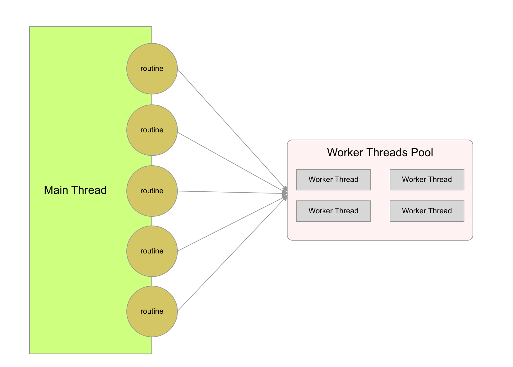

# node-routine


[](https://www.npmjs.com/package/node-routine)
[](https://www.npmjs.com/package/node-routine)
[](https://www.codacy.com/app/joway/node-routine?utm_source=github.com&amp;utm_medium=referral&amp;utm_content=joway/node-routine&amp;utm_campaign=Badge_Grade)


node-routine is a library to implement [Goroutine-Like API](https://gobyexample.com/goroutines) with [worker_threads](https://nodejs.org/api/worker_threads.html).

Compared to using the worker threads low level API directly, node-routine can make your codes more elegantly, like:

```
await go(() => (Math.random()))
```

## Documentation

[Documentation](https://routine.joway.io)

## Architecture



## Requirement

- Nodejs >= 11.7
- Nodejs >= 10.5 with `--experimental-worker` flag

## Install

```shell
npm install -S node-routine
```

## Quick Example

```javascript
const { go, init, shutdown } = require('node-routine')

// init a worker threads pool
init({
  maxWorkerThreads: 2,
})

async function calc() {
  // every routine will be executed in worker threads pool
  const count = 10000
  const num = await go(() => {
    let total = 0
    for (let i = 0; i < count; ++i) {
      total += i
    }
    return total
  }, { count })

  return num
}

calc().then((total) => {
  console.log('Got', total)
  shutdown()
})
```

## Benchmark

- [node-routine](https://github.com/joway/node-routine)
- [microjob](https://github.com/wilk/microjob)

[Benchmark Code](bench/bench.ts)

Env: Macbook Pro, 13-inch, 2018, 2.3 GHz Intel Core i5

Commend: `npm run bench`

```
  ✓ CPU intensive task using microjob (14ms)
  ✓ CPU intensive task using node-routine (4ms)
  ✓ IO intensive task using microjob (20163ms)
  ✓ IO intensive task using node-routine (5224ms)
```
