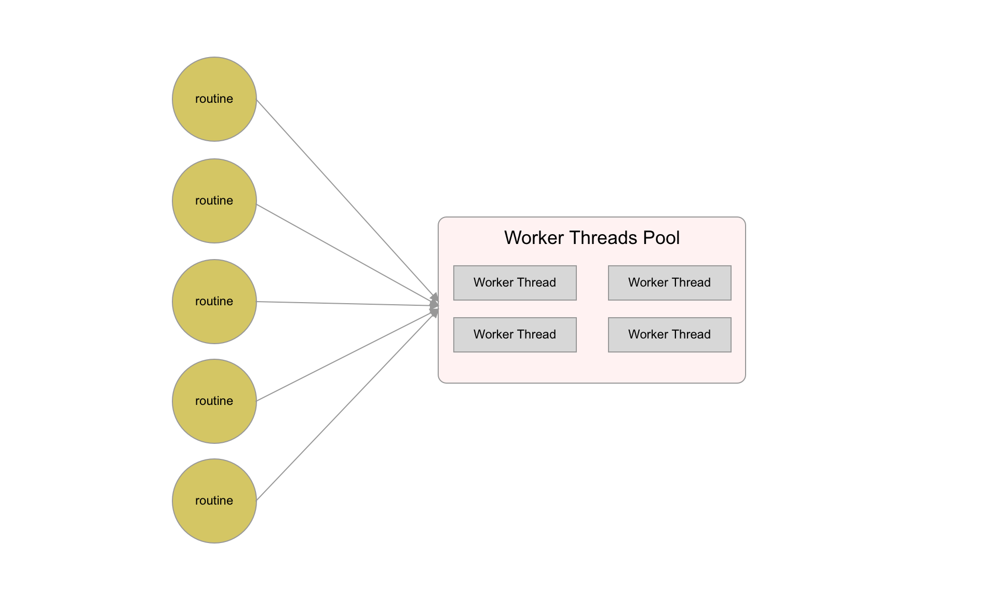

# node-routine


[](https://www.npmjs.com/package/node-routine)
[](https://www.npmjs.com/package/node-routine)
[](https://www.codacy.com/app/joway/node-routine?utm_source=github.com&amp;utm_medium=referral&amp;utm_content=joway/node-routine&amp;utm_campaign=Badge_Grade)


node-routine is a library to implement [Goroutine-Like API](https://gobyexample.com/goroutines) with [worker_threads](https://nodejs.org/api/worker_threads.html).

## Architecture



## Requirement

- Nodejs >= 11.7 or using `--experimental-worker` flag

## Install

```shell
npm install -S node-routine
```

## Quick Example

```javascript
const { routine, initWorkerPool } = require('./lib')

// init a worker threads pool
initWorkerPool({
  maxWorkerThreads: 2,
})

async function calc() {
  // every routine will be executed in worker threads pool
  const num = await routine(() => {
    const count = 10000
    let total = 0
    for (let i = 0; i < count; ++i) {
      total += i
    }
    return total
  })

  return num
}

calc()
```


